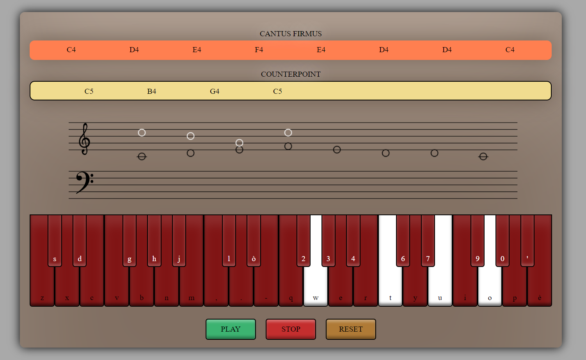

# Cantus Firmus & Counterpoint

## Authors:
* Paoletti Andrea
* Stagno Stefano
* Costa Gabriele

### Date: 07/02/2023

## App description

The project's aim is to guide the user through the composition of a cantus firmus and a counterpoint against it.

The term _cantus firmus_ is used to refer to a fixed melody that forms the basis for a polyphonic composition. Cantus 
firmus always abides by a basic set of rules. These rules mostly derive by the fact that this form of melody is generally 
conceived to be singed: it must be singable and "musical", which usually means simple, not dissonant, with few leaps and 
a limited range. _Counterpoint_ is the technique of writing independent melodic lines that, when superimposed, work 
together to create effective music.
There are many species of counterpoint and our app rely on the first species.

The main idea behind the implementation of the cantus firmus' rules is to consider notes as numerical indexes and, 
starting from the first note played by the user, to update the set of indexes representing the allowed or not allowed 
notes for the following step. The same approach has been used to implement the counterpoint's rules, but in this case 
there's a further condition: the notes of the counterpoint have to be coherent (that is to say harmonically consonant) 
with notes played previously in the catus firmus.

As far as the code is concerned, the core of the app is the `newPossibilities` function, which contains the implementation 
of all the rules related to the composition of both cantus firmus and counterpoint. Thanks to a series of conditional 
statements, this function is able to take the last note we've played and to indicate which notes are right and which 
note are wrong for the following step. We'll be able to play only the right notes, because the wrong ones will be coloured 
in red and made impossible to be pressed.

Here the link to the [GitHub](https://github.com/GabrieleCosta00/ACTAM_Project_2023) repository.
And this is the [link](https://gabrielecosta00.github.io/Cantus-Firmus-Counterpoint/) to the web app.

https://user-images.githubusercontent.com/115801063/218269557-0a6ec3e6-4709-45c6-ae0f-ffbf8bd59da7.mp4

